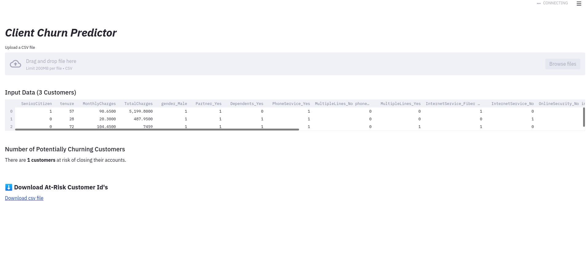

# ANNHUB Python client-side examples

A collection of easy-to-use code examples for ANNHUB Python library, which delivers a simple UI to integrate with ANNHUB server-side application.

## Prerequisite

* Python 3.7
* Docker

## Step-by-step example
1. Create the code structure as follows:
```angular2html
|-- <app-name>
	|-- app.py
	|-- Dockerfile
	|-- requirements.txt
```
In this structure:
* **app.py**: Contain your application's logic and UI development.
* **Dockerfile**: Docker's config to build your docker image. Replace your host in **line 6**, your host is obtained from server-side application's address.


* **requirements.txt**: Reuse our example if you don't import any additional library.

2. In your working directory, build your application as an docker image.
```bash
$ docker build --tag <your dockerhub account>/<docker application name>:<your company name-version> .
```
For example: 
```bash
$ docker build --tag anscenterari/sale-price-prediction .
```
3. Login to dockerhub to remote control your application between many servers.
 ```
 $ docker login
 ```
 If you do not have any dockerhub account, you can use ours.
 ```
 username: anscenterari
 password: aihack2021
 ```
 4. Run your application within a docker container:
 ```
 $ docker run -d -p 8501:8501 anscenterari/sale-price-prediction
 ```
 5. Push your docker image to the remote repository (dockerhub)
 ```
 $ docker push <your image tag>
 ```
 For example:
 ```
 $ docker push anscenterari/sale-price-prediction
 ```
## Usage
After you complete the above instructions, you can use application as a web-based interface.


